# JavaProject3
#Exercise Scheduler(검색, DB구현)
1. Menu

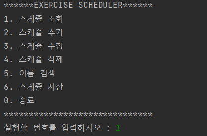

2. 스케쥴 조회

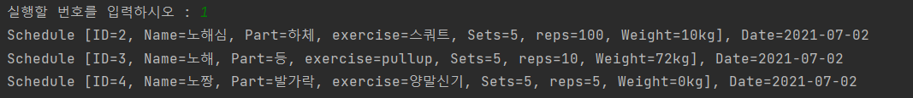

3. 스케쥴 추가

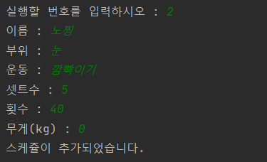

- 추가된 스케쥴

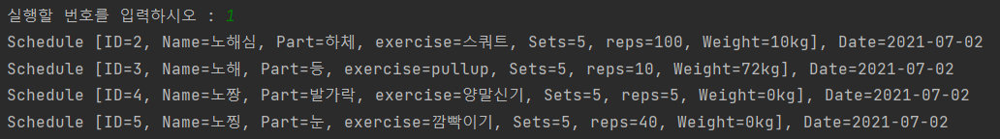

4. 이름 검색

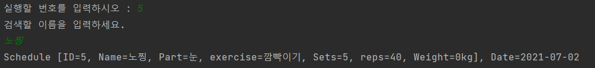

5.  스케쥴 수정

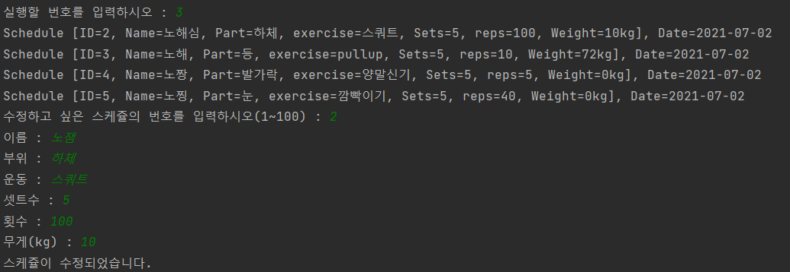

- 수정된 스케쥴

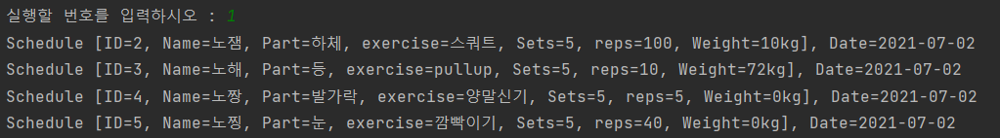

5. 스케쥴 삭제

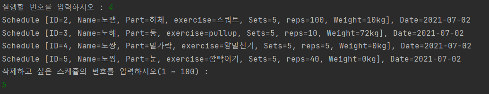

- 삭제된 스케쥴

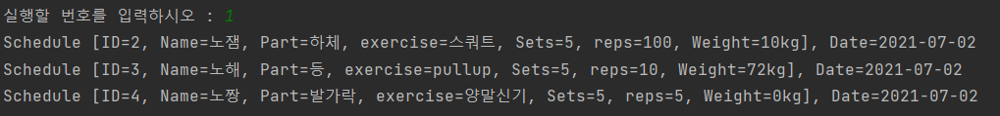

6. 스케쥴 저장

- 스케쥴이 저장된 파일

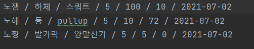

7. 종료

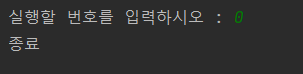

8. 쿼리문 실행
- DATA table 조회

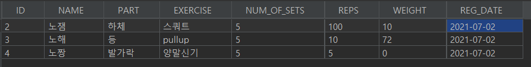

- DATA table에 'supporter' column 추가

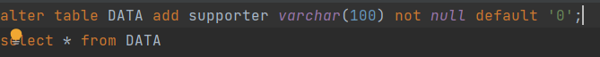

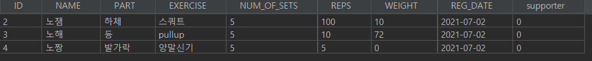
